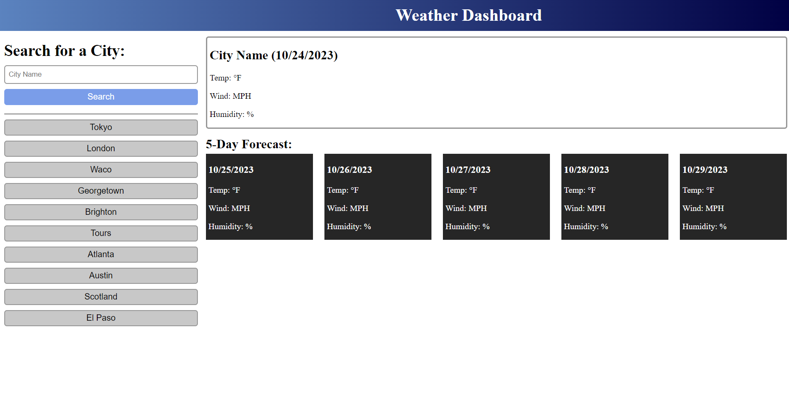

# weather-dashboard

## Description
This project was to help me learn how to use server side APIs to create functionality for an existing webpage. I learned how to use the fetch global function to connect to a server using a URL and how to traverse the returned data to use specific content in my webpage. I also learned how to connect to the Bootstrap CSS framework API, and the icons it provides, to use in my code. Using localStorage allowed me to save user city inputs to be used as a search history for later use that wouldn't get deleted when the page refreshed.

## Usage
To use this webpage, input a city into the textbox. If the city is known by the weather api library, it will display the current and five day forecast: temp, wind speed, humidity, and forecast as an icon. The user can also select one of the cities from the search history bar and it will pull up the weather information of that city.

## Screenshots

## Live Application
The link to the live application of the webpage is: 

## Source Code
The source code is located at the website 
